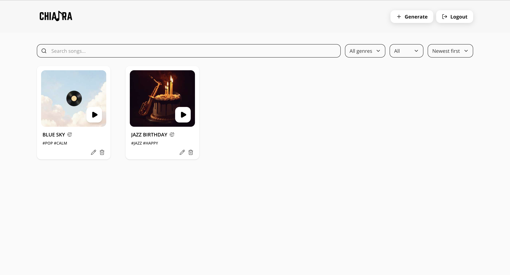
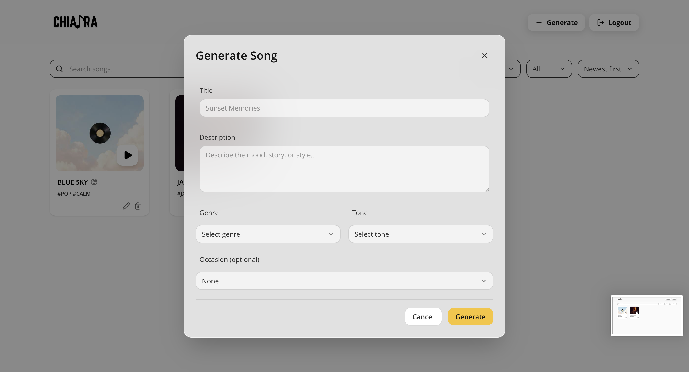
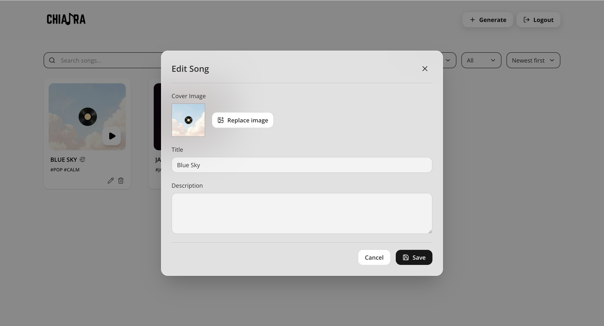
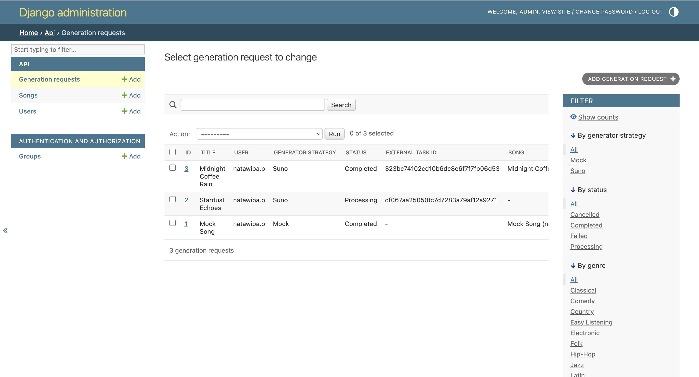

# Chithara — AI Music Generation

Chithara is a full-stack web application for AI-powered music generation using the Suno API.  
Users can generate songs from text prompts and manage a personal music library.

## Tech Stack

| Layer | Technology |
|-------|------------|
| Frontend | Vue 3, Vite, Tailwind CSS |
| Backend | Django 5, psycopg3 |
| Database | PostgreSQL 15 |
| AI | Suno API (pluggable strategies) |

## Table of Contents

1. [Prerequisites](#1-prerequisites)
2. [Environment Configuration](#2-environment-configuration)
3. [Docker Setup (Recommended)](#3-docker-setup-recommended)
4. [Manual Setup](#4-manual-setup)
5. [Mock vs Real Song Generation](#5-mock-vs-real-song-generation)
6. [API Overview](#6-api-overview)
7. [Troubleshooting](#7-troubleshooting)
8. [Project Structure](#8-project-structure)

---

# 1. Prerequisites

## Docker setup
- [Docker Desktop](https://www.docker.com/products/docker-desktop/) (includes Docker Compose)

## Manual setup
- Python 3.11+
- Node.js 20+
- PostgreSQL 15+

---

# 2. Environment Configuration

Copy the example config and edit it:

```bash
cp backend/.env.example backend/.env
```

Minimum required values:

```env
# Django
DJANGO_SECRET_KEY=replace_me          # generate with: python -c "import secrets; print(secrets.token_urlsafe(50))"
DEBUG=True
ALLOWED_HOSTS=localhost,127.0.0.1

# Database
POSTGRES_DB=musicdb
POSTGRES_USER=musicuser
POSTGRES_PASSWORD=musicpassword
POSTGRES_HOST=localhost                # use "db" when running via Docker
POSTGRES_PORT=5432

# Generation strategy
GENERATOR_STRATEGY=mock               # "mock" for dev, "suno" for real API
MOCK_SONG_AUDIO_URL=https://example.com/mock/generated-song.mp3

# Google OAuth
GOOGLE_OAUTH_CLIENT_ID=your_google_client_id
GOOGLE_OAUTH_CLIENT_SECRET=your_google_client_secret
GOOGLE_OAUTH_REDIRECT_URI=http://localhost:8000/api/auth/google/callback/
```

> `POSTGRES_HOST` is overridden to `db` automatically by `docker-compose.yml` — no manual change needed for Docker.

---

# 3. Docker Setup (Recommended)

One command starts the database, runs migrations, and launches both servers with live-reload:

```bash
docker compose up --build
```

| Service | URL |
|---------|-----|
| Frontend (Vite) | http://localhost:5173 |
| Backend (Django) | http://localhost:8000 |
| PostgreSQL | localhost:5432 |

**Subsequent starts** (no code changes):

```bash
docker compose up
```

**Stop all containers:**

```bash
docker compose down
```

**Reset database** (drops all data):

```bash
docker compose down -v
```

---

# 4. Manual Setup

## Install dependencies

```bash
# Backend
python3 -m venv .venv
source .venv/bin/activate          # Windows: .venv\Scripts\activate
pip install -r backend/requirements.txt

# Frontend
cd frontend && npm install && cd ..
```

## Create PostgreSQL database

```bash
psql postgres          # macOS; Linux: sudo -u postgres psql
```

```sql
CREATE USER musicuser WITH PASSWORD 'musicpassword';
CREATE DATABASE musicdb OWNER musicuser;
GRANT ALL PRIVILEGES ON DATABASE musicdb TO musicuser;
\q
```

## Run migrations and start servers

```bash
# Terminal 1 — backend
cd backend
python manage.py migrate
python manage.py runserver

# Terminal 2 — frontend
cd frontend
npm run dev
```

---

# 5. Mock vs Real Song Generation

**Mock** (default, no API key needed):

```env
GENERATOR_STRATEGY=mock
MOCK_SONG_AUDIO_URL=https://example.com/mock/generated-song.mp3
```

**Real Suno API:**

```env
GENERATOR_STRATEGY=suno
SUNO_API_KEY=your_api_key
SUNO_API_BASE_URL=https://api.sunoapi.org/api/v1
SUNO_CALLBACK_URL=http://localhost:8000/api/suno/callback/
```

---

# 6. API Overview

All endpoints are prefixed with `/api/`.

| Method | Endpoint | Description |
|--------|----------|-------------|
| POST | `/auth/register/` | Register |
| POST | `/auth/login/` | Login (Google OAuth redirect) |
| GET | `/auth/google/callback/` | Google OAuth callback |
| POST | `/auth/logout/` | Logout |
| GET | `/songs/` | List user's songs |
| POST | `/generate/` | Generate a song |
| GET | `/generate/<id>/status/` | Poll generation status |
| PATCH | `/songs/<id>/` | Update song metadata |
| DELETE | `/songs/<id>/` | Delete song |
| GET | `/library/` | Public library |
| GET | `/songs/<id>/share/` | Shareable song link |

---

# 7. Troubleshooting

### `relation "django_session" does not exist`
Migrations have not been applied. With Docker this is automatic on startup. For manual setup, run:
```bash
cd backend && python manage.py migrate
```

### Backend can't connect to PostgreSQL
- **Docker:** Make sure the `db` container is healthy — the backend waits for the healthcheck before starting.
- **Manual:** Ensure PostgreSQL is running (`brew services start postgresql@15` / `sudo systemctl start postgresql`).

### `role "musicuser" does not exist`
```sql
CREATE USER musicuser WITH PASSWORD 'musicpassword';
```

### `database "musicdb" does not exist`
```sql
CREATE DATABASE musicdb OWNER musicuser;
```

### Frontend can't reach the API
- **Docker:** The Vite proxy targets `http://backend:8000` via the `VITE_API_TARGET` env var set in `docker-compose.yml`.
- **Manual:** The proxy targets `http://localhost:8000` by default. Make sure Django is running on port 8000.

### Django not found (manual setup)
```bash
source .venv/bin/activate
pip install -r backend/requirements.txt
```

---

# 8. Project Structure

```text
chithara-ai-music-web/
├── docker-compose.yml
├── backend/
│   ├── Dockerfile
│   ├── manage.py
│   ├── requirements.txt
│   ├── .env.example
│   ├── api/
│   │   ├── models/
│   │   ├── services/
│   │   ├── views/
│   │   └── migrations/
│   └── config/
│       └── settings.py
├── frontend/
│   ├── Dockerfile
│   ├── vite.config.js
│   ├── package.json
│   └── src/
│       ├── pages/
│       ├── components/
│       ├── api/
│       └── router/
└── screenshots/
```

---

<div align="center">
	<b>Screenshots</b><br><br>
	
	
	
	
	
</div>
